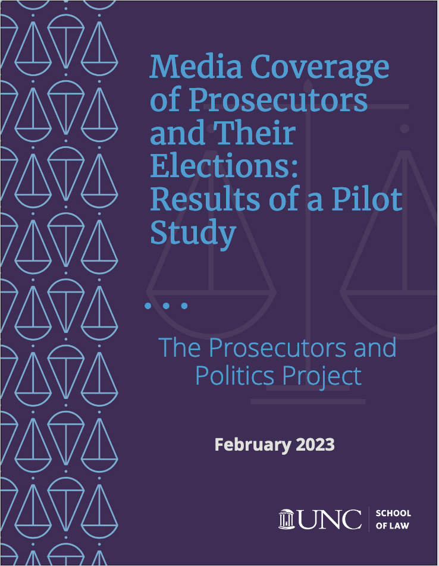

Media Coverage of Prosecutors and Their Elections: Results of a Pilot
Study
================
Ryan Thornburg

- <a href="#project-goal" id="toc-project-goal">Project goal</a>
- <a href="#project-notes" id="toc-project-notes">Project notes</a>
  - <a href="#staff-involved" id="toc-staff-involved">Staff involved</a>
  - <a href="#data-source" id="toc-data-source">Data source</a>
- <a href="#technical" id="toc-technical">Technical</a>
  - <a href="#project-setup-instructions"
    id="toc-project-setup-instructions">Project setup instructions</a>
- <a href="#data-notes" id="toc-data-notes">Data notes</a>

Part of the the [Prosecutors and Politics
Project](https://law.unc.edu/academics/centers-and-programs/prosecutors-and-politics-project/)
at the [UNC School of Law](https://law.unc.edu/)

Full report:
<https://law.unc.edu/wp-content/uploads/2023/02/REPORT-FINAL-2.15.23.pdf>

*Code and repository by Ryan Thornburg (<ryan.thornburg@unc.edu>)*

## Project goal

*From the [full
report](https://law.unc.edu/wp-content/uploads/2023/02/REPORT-FINAL-2.15.23.pdf):*

“Prosecutors play an important role in the criminal justice system.
Their discretion to decline charges and to plea bargain give prosecutors
the power to greatly affect how many people go to prison and for how
long. Politics — specifically elections — are one of the few checks on
prosecutorial power. Voters can vote out local prosecutors who abuse
their power or who do not act in the public interest.

“The ability of elections to serve as a check on prosecutors’ power
depends on what voters know. If voters are unaware of or uninformed
about what their local prosecutor is doing, then they cannot make
informed choices about whether to retain an incumbent prosecutor or
whether to vote that prosecutor out of office. But most voters do not
have the time or the ability to assess their prosecutors’ performance;
instead, they rely on media outlets to inform them. …

“This pilot study aims to improve the discussion surrounding media
coverage of the criminal justice system more generally and of
prosecutors in particular. It provides a glimpse into the quantity and
the quality of the media coverage that prosecutors receive during an
election year in print news articles, as well as a limited number of
local and national television news broadcasts. Specifically, the study
quantifies the amount of media coverage, the content of coverage, and
the tone of coverage that prosecutors and candidates for prosecutor
receive. The study includes data from a sample of five to 10 prosecutor
elections in four different states. In total, the study examines 27
prosecutor elections in jurisdictions of varying populations; some of
those elections were contested, while others were uncontested. In the
contested elections, the study also includes information about the
coverage that candidates for the office of prosecutor received. All
told, the study examined nearly 2,000 articles— every article that
mentioned the elected prosecutor or a candidate for the office in the
calendar year 2020.”

## Project notes

### Staff involved

Questions about this report should be directed to the PPP director,
Professor Carissa Byrne Hessick at <chessick@email.unc.edu>.

Associate Professor Ryan Thornburg, UNC School of Journalism and Media,
played a key role in research design. He also performed the data
analysis and wrote portions of the report.

Amy Ullrick did significant work obtaining data, refining spreadsheets,
and managing the data flow for the entire project.

This report would not have been possible without the hard work of many
students at the University of North Carolina School of Law, including
Michael Griffith, Kate Kozain, Meighan Parsh, Abigail Perdew, Lydia
Shelley, Jacob Showers, Gabrielle Supak, Tyler Ventura, Anna Washa, and
Rachel Weisz. These students read through and coded thousands of news
articles and contributed research necessary to produce this report.

### Data source

Hessick, Carissa; Thornburg, Ryan, 2023, “Pilot Study of Media Coverage
for Prosecutors and Prosecutor Elections, 2020”,
<https://doi.org/10.15139/S3/3SWIKQ>, UNC Dataverse, V1

## Technical

This project skeleton was built using [AP
DataKit](http://datakit.ap.org/)

### Project setup instructions

After cloning the git repo:

Open `prosproj_github_repo.Rproj` in RStudio.

`source("etl/load_data.R")` will pull two spreadsheets from the UNC
DataVerse and create one dataframe called incumbents and another for all
the candidates who were not incumbents.

This calls `etl/competitive_seats.R`, which will create three data
frames – one for incumbents, one for non-incumbents and one combined –
that shows for each contest the number of incumbent candidates, the
number of non-incumbent candidates and whether the seat is “uncontested”
(an incumbent with no challengers), “contested” (at least one incumbent
and one challenger), or “open” (no incumbent).

It also calls `etl/binding_incumbents_challengers.R`, which creates data
frame called `all_mentions`. This data frame includes all variables that
the “incumbent” and “non-incumbent” data frames have in common.

## Data notes

*Data notes TK*
